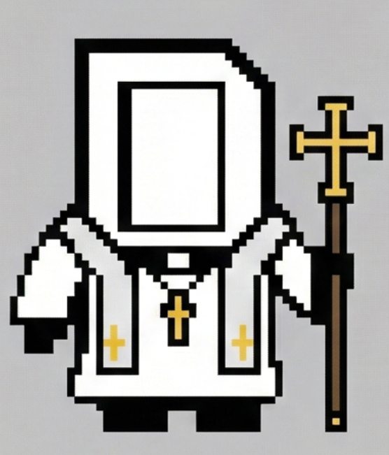
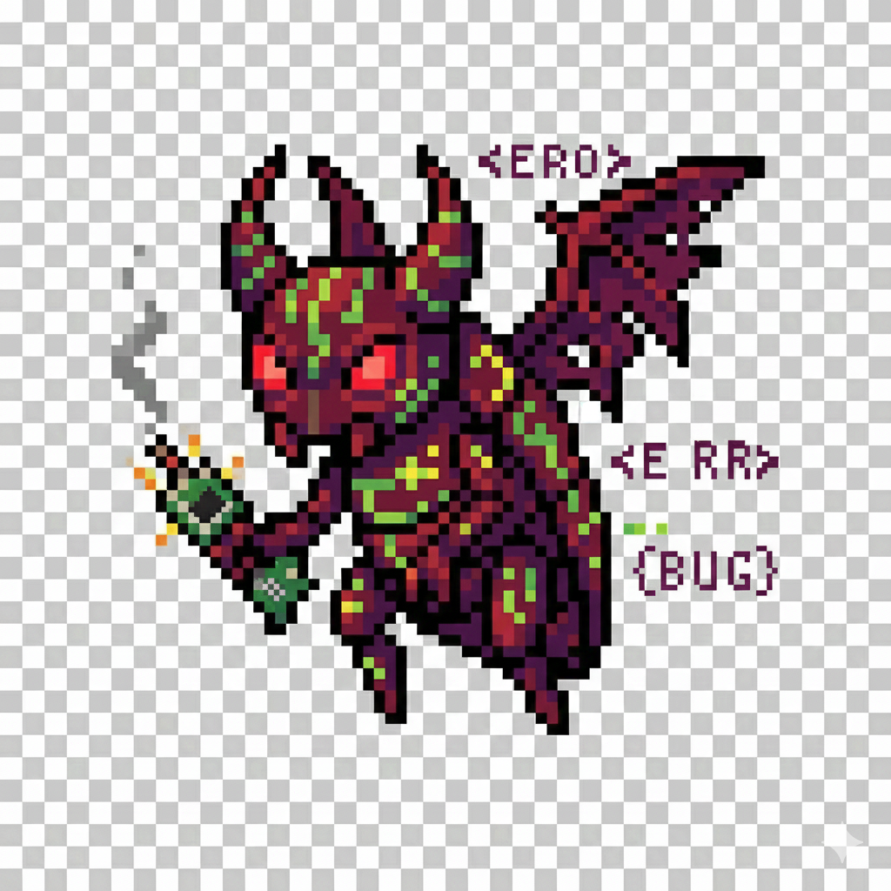

# Karel RogueLike - Roguelike de Supervivencia por Tiempo

Un juego roguelike de acción donde como Holy Karel debes sobrevivir el mayor tiempo posible contra oleadas de cybordemons cada vez más fuertes.

## Controles
- **Ataque a distancia**: automatico
- **W**: Moverse arriba
- **S**: Moverse abajo
- **A**: Moverse a la izquierda
- **D**: Moverse a la derecha
- **ESPACIO**: Atacar (golpea enemigos en un círculo alrededor del jugador)
- **R**: Reiniciar juego (cuando mueres)
- **ESC**: Salir del juego

## Cómo Jugar

1. Usa WASD para moverte por el mapa
2. Los enemigos aparecerán desde los bordes de la pantalla
3. Acercate a los enemigos para para activar el autoataque
4. Presiona ESPACIO para atacar a los enemigos con un santo circulo
5. Evita que los enemigos te toquen, te causarán daño
6. Sobrevive el mayor tiempo posible
7. A mayor tiempo, más enemigos aparecerán simultáneamente

## Estadísticas del Juego

- **Vida del Jugador**: 100 HP
-  **Daño de AutoAtaque**: 30 HP por golpe
- **Daño de Ataque**: 20 HP por golpe
- **Rango de Ataque**: 80 píxeles
- **Cooldown de Ataque**: 0.5 segundos
- **Vida de Enemigo**: 30 HP
- **Daño de Enemigo**: 10 HP por contacto
- **Rango de Detección**: 300 píxeles
## Características Implementadas

 **Sistema de Combate Completo**
- Ataques del jugador con área de efecto (círculo)
- Auto-Ataque que se activa al acercarse a un enemigo
- Sistema de daño para jugador y enemigos
- Barras de vida para jugador y enemigos
- Cooldown de ataque para jugador y enemigos

 **IA de Enemigos Inteligente**
- Los enemigos persiguen al jugador dentro de un rango de detección
- Sistema de patrulla cuando el jugador no está en rango
- Ataques automáticos al colisionar con el jugador
- Oleadas de enemigos que aumentan en dificultad con el tiempo

 **Sistema de Colisiones**
- Detección de colisiones entre jugador y enemigos
- Detección de ataque (área circular)
- Límites de pantalla

 **Interfaz de Usuario**
- Barra de vida del jugador en la esquina superior izquierda
- Contador de tiempo de supervivencia
- Número de enemigos vivos
- Contador de enemigos derrotados
- Pantalla de Game Over con estadísticas

 **Mecánicas de Juego**
- Generación progresiva de enemigos
- Dificultad aumenta con el tiempo
- Reinicio de juego tras morir
## Arquitetura del Código

- `main.py`: Loop principal del juego, lógica de estados y spawn de enemigos
- `player.py`: Clase del jugador con movimiento, combate y gestión de salud
- `enemy.py`: Clase del enemigo con IA de persecución y combate
- `collision.py`: Sistema de detección de colisiones
- `ui.py`: Gestor de interfaz de usuario
- `settings.py`: Configuración global del juego
- `level.py`: Para futuras expansiones (generación de niveles)

